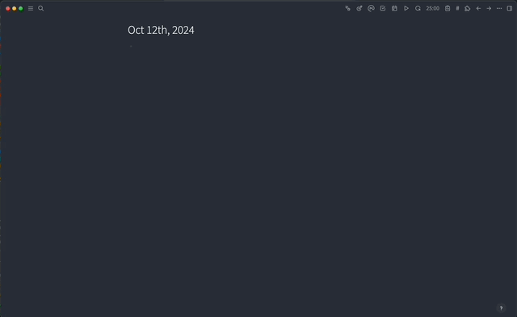

# 🦙 logseq-ollama-chat plugin

A plugin to integrate [ollama](https://github.com/jmorganca/ollama) with [logseq](https://github.com/logseq/logseq) to have a chat with the AI model directly from logseq

# Get Started
- First you will need to setup [ollama](https://github.com/jmorganca/ollama) you can check their github repo for instructions on how to setup ollama
- That's it once you setup ollama you should be able to use the plugin with no problem

# Features
- The plugin currently has 2 tools that the model can be used for
  - date getter -> This tool is used to get the current date
  - Document Search -> This tool is used to search for a document in the logseq database
- Respects theming
- Settings for changing the host of the model, the model itself and a shortcut to open the plugin command palette
- Use configuration page `ollama-logseq-config` to add more context manual commands

# Demo
To open the chatoverlay you can use the shortcut `cmd+shift+o` or `ctrl+shift+o` on windows. 
To close the chatoverlay you can use the shortcut `esc`.

# Contribution
If you have any features suggestions feel free to open an issue or a PR
